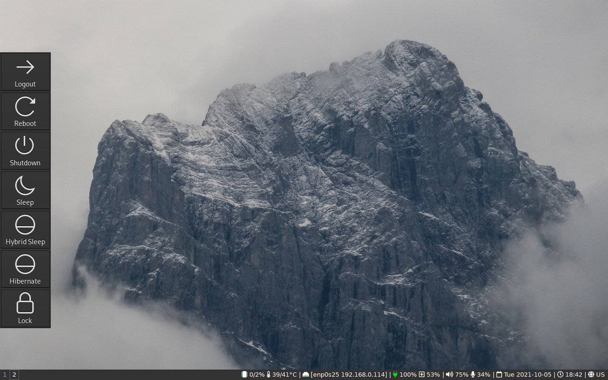

# wlogoutbar

Minimal logout bar, originally a fork of [nwg-bar](https://github.com/nwg-piotr/nwg-bar)

Aimed at sway, works with wlroots-based compositors only.

The `wlogoutbar` command creates a button bar with power control options.
By default the command displays a horizontal bar on the left of the screen.
Use command line arguments to change the placement.

## Building

### Dependencies

- go >=1.16 (just to build)
- gtk3
- gtk-layer-shell

### Steps

1. Clone the repository, cd into it.
2. `sh build.sh`

Building the gotk3 library takes ages for the first time. If your machine is
glibc x86\_64, you can skip building and use released binary directly.
